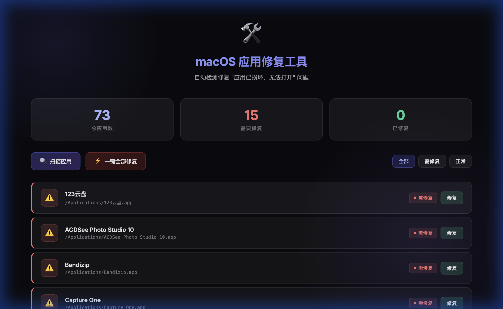

# 🛠️ macOS 应用修复工具

> 一键修复 macOS 提示 **"应用程序已损坏，无法打开"** 的问题

自动扫描 `/Applications` 目录，检测含有安全隔离属性（`com.apple.quarantine`）的应用，并提供可视化的一键修复方案。



## ✨ 功能特性

- 🔍 **自动扫描** — 页面加载后自动检测所有应用的隔离属性状态
- ⚡ **一键全部修复** — 批量移除隔离属性 + 重新签名，实时显示进度
- 🔧 **单个修复** — 也可针对单个应用单独修复
- 📋 **实时日志** — 底部面板展示每一步执行的命令和结果
- 🎨 **现代化 UI** — 深色毛玻璃主题，状态一目了然
- 🖥️ **筛选过滤** — 支持按「全部 / 需修复 / 正常」快速筛选

## 📋 完整解决方法

一般情况下，只需步骤 1 和 2 即可解决。本工具**自动完成步骤 2 和 4**，步骤 1、3、5 需要手动操作（工具界面中有详细指引）。

### 步骤 1：允许“任何来源”下载的 App 运行

打开终端执行：

```bash
sudo spctl --master-disable
```

然后前往：

- **macOS Monterey 及更早**：系统偏好设置 → 安全性与隐私 → 通用 → 勾选「任何来源」
- **macOS Ventura 及以后**：系统设置 → 隐私和安全性 → 安全性 → 选择「任何来源」

### 步骤 2：移除应用的安全隔离属性 ⚙️ *工具自动完成*

```bash
sudo xattr -dr com.apple.quarantine /Applications/App.app
```

### 步骤 3：macOS Ventura / Sonoma / Sequoia 额外确认

上述两步完成后，首次打开应用时还需要手动确认一次：

系统设置 → 隐私和安全性 → 安全性 → 点击下方出现的「仍要打开」按钮

> 该操作仅需一次，之后可正常打开。

### 步骤 4：重新签名 ⚙️ *工具自动完成*

如果因证书问题仍无法打开，可尝试重新签名：

```bash
codesign --force --deep --sign - /Applications/App.app
```

前提：需安装 Xcode Command Line Tools（`xcode-select --install`）。

### 步骤 5：覆盖恶意软件保护

如果提示「应用将对您的电脑造成伤害」，以上步骤均无效时：

访达 → 应用程序 → 右击该应用 → 显示简介 → 勾选「覆盖恶意软件保护」

> ⚠️ 正常应用一般不会出现该选项。

## 🚀 快速开始

### 前提条件

- macOS 10.15+ (Catalina / Ventura / Sonoma / Sequoia)
- Python 3.8+（macOS 自带）

### 方法一：双击启动（推荐）

1. [下载 ZIP](https://github.com/你的用户名/macos-app-repair-tool/archive/refs/heads/main.zip) 并解压
2. 在 Finder 中打开解压后的文件夹
3. **双击 `启动修复工具.command`**

> 首次运行可能提示"无法打开"，请右键点击该文件 → 选择「打开」即可。

就这么简单！脚本会自动：
1. ✅ 配置 Python 虚拟环境 & 安装依赖
2. ✅ 弹出密码框获取管理员权限
3. ✅ 启动修复服务
4. ✅ 自动打开浏览器

**全程无需手动输入任何命令。** 关闭终端窗口即可停止服务。

### 方法二：命令行启动

```bash
git clone https://github.com/你的用户名/macos-app-repair-tool.git
cd macos-app-repair-tool
bash start.sh
```

然后在浏览器打开 **http://localhost:5555**。

## 📁 项目结构

```
.
├── 启动修复工具.command  # ⬅️ 双击此文件启动
├── app.py              # Flask 后端（扫描 / 修复 API）
├── start.sh            # 命令行启动脚本
├── requirements.txt    # Python 依赖
└── templates/
    └── index.html      # Web 前端界面
```

## 🔌 API 接口

| 方法 | 路径                    | 说明                                   |
| ---- | ----------------------- | -------------------------------------- |
| GET  | `/api/scan`             | 扫描所有应用及其隔离属性状态           |
| POST | `/api/fix`              | 修复指定应用（body: `{path, actions}`) |
| POST | `/api/fix-all`          | 一键修复所有有问题的应用               |
| GET  | `/api/app-detail?path=` | 获取单个应用的详细信息                 |
| GET  | `/api/check-xcode-cli`  | 检查 Xcode CLI Tools 安装状态          |

## ⚠️ 注意事项

- 需要 **sudo 权限** 才能修改应用的扩展属性和签名
- 本工具适用于从第三方渠道获取的合法应用，请确认应用来源的安全性
- 重新签名使用 ad-hoc 签名（`-`），不涉及开发者证书

## 📌 适用场景

本工具解决以下 macOS 常见提示：

- ❌ **"应用程序" 已损坏，无法打开。您应该将它移到废纸篓。**
- ❌ **无法打开"应用程序"，因为无法验证开发者。**
- ❌ **"应用程序" 将对您的电脑造成伤害。您应该将它移到废纸篓。**

## 🖥️ 适用系统

- macOS Catalina (10.15)
- macOS Ventura (13)
- macOS Sonoma (14)
- macOS Sequoia (15)

## 📄 许可证

MIT License

## 🙏 致谢

修复方法参考自 [sysin.org](https://sysin.org/blog/macos-if-crashes-when-opening/)。
